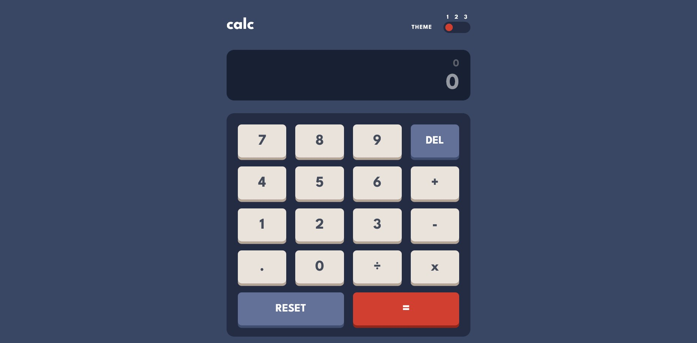
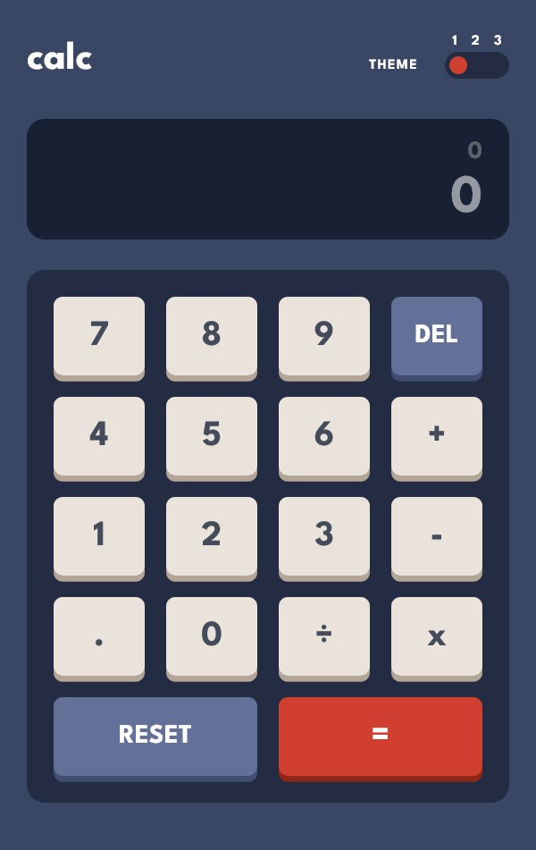

# Frontend Mentor - Calculator app
This is a solution to the [Calculator app challenge on Frontend Mentor](https://www.frontendmentor.io/challenges/calculator-app-9lteq5N29). Frontend Mentor challenges help you improve your coding skills

## Features
- View the optimal layout for the app depending on their device's screen size
- Perform mathmatical operations like addition, subtraction, multiplication, and division
- Adjust the color theme based on their preference

## Screenshots

## Built with
- React
- TypeScript
- Vailla CSS
